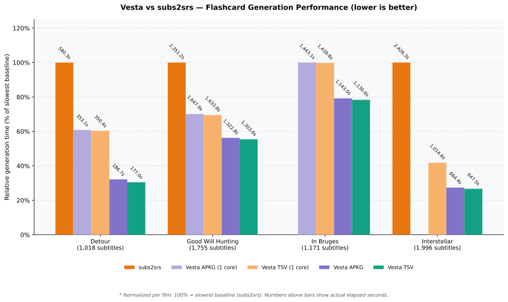

#  Vesta

> [!WARNING]
> **Work in Progress**: This README is currently temporary and a work in progress (WIP), is subject to ongoing reorganization, and will be further refined and expanded.

**subs2srs, but actually fast.**

Vesta is a modern desktop application for language learners and power users that turns video and subtitle files into rich, synchronized Anki flashcard decks, auto-aligned subtitles, and translated media in minutes instead of hours — running **~2.5× faster than subs2srs** with parallel multi-core processing.



---

## Core Features

### 1. Flashcard Generation & Anki (.apkg / TSV) Export
- **Self-Contained `.apkg` Packages**: Exports native SQLite Anki collections with zero manual import mapping needed.
- **Rich Media Cards**: Attach synchronized audio snippets, high-resolution snapshots, or compact video clips to each card.
- **Modern Codec Support**:
  - **Audio**: MP3 or Opus (ultra-low bitrate speech compression).
  - **Snapshots**: WebP, AVIF, or JPEG with customizable resolution presets (144p to 1080p) and quality tuning.
  - **Video Clips**: H.264 or MPEG-4 with hardware acceleration and ultrafast encoding presets.
- **Audio & Video Enhancements**:
  - **EBU R128 Loudness Normalization**: Balances whispering and loud action scenes across cards.
  - **Audio Track Selection**: Extract from multi-language audio streams (e.g. Japanese audio from dual-audio releases).
  - **Subtitle Crop**: Automatically crop bottom borders to remove burned-in hardsubs from snapshots.
  - **Context & Sentence Merging**: Attach leading/trailing context dialogue lines or automatically join split subtitle sentences.
- **Card Styling & Dark Mode**: Beautiful, responsive card templates with native dark-mode support and automatic font stack injection tailored for target languages (CJK Noto, Arabic, Thai, Devanagari, Hebrew, Cyrillic, etc.).

### 2. Difficulty Tagging & Vocabulary Profiling
Vesta automatically analyzes the lexical complexity of each subtitle sentence and tags cards with their proficiency level (e.g., `HSK::3`, `CEFR::B1`, `JLPT::N2`, `TOPIK::3`, `TOCFL::B2`):
- **Pre-Bundled Official Vocabulary Databases & Original Sources**:
  - 🇨🇳 **HSK** (Simplified Chinese): 12,500+ official words (HSK 1–6) — [Official CTI Portal](http://www.chinesetest.cn/) / [Hanban & Ministry of Education PRC](http://www.moe.gov.cn/) · [HSK Open Vocabulary Datasets](https://github.com/gigacover/hsk)
  - 🇹🇼 **TOCFL** (Traditional Chinese): 11,100+ words (Levels 1–6 / A1–C2) — [SC-TOP Official Portal](https://tocfl.edu.tw/) · [SC-TOP 8000 Vocabulary Downloads](https://tocfl.edu.tw/index.php/exam/download)
  - 🇯🇵 **JLPT** (Japanese): 13,900+ words across kanji and kana readings (N5–N1) — [Official JLPT (JEES & Japan Foundation)](https://www.jlpt.jp/) · [Jonathan Waller's JLPT Resources](https://www.tanos.co.uk/jlpt/) · [EDRDG / JMdict](https://www.edrdg.org/jmdict/j_jmdict.html)
  - 🇰🇷 **TOPIK** (Korean): 6,600+ words (Levels 1–6) — [Official TOPIK Portal (NIIED)](https://www.topik.go.kr/) · [National Institute of Korean Language (국립국어원)](https://www.korean.go.kr/)
  - 🇪🇺 **CEFR Multi-lingual**: Dedicated European databases mapped from A1 to C2:
    - 🇬🇧 **English** (8,600+ words) — [Council of Europe CEFR](https://www.coe.int/en/web/common-european-framework-reference-languages) · [Cambridge English Profile (EVP)](https://www.englishprofile.org/) · [Oxford 3000/5000](https://www.oxfordlearnersdictionaries.com/wordlists/)
    - 🇩🇪 **German** (41,900+ entries) — [Goethe-Institut / Profil Deutsch](https://www.goethe.de/)
    - 🇮🇹 **Italian** (19,900+ entries) — [CLIQ / Università per Stranieri di Perugia & Siena](https://www.unistrapg.it/) · [OpenSubtitles Lexical Frequency](https://opus.nlpl.eu/OpenSubtitles.php)
    - 🇫🇷 **French** (19,900+ entries) — [France Éducation International / CECRL (DELF-DALF)](https://www.france-education-international.fr/)
    - 🇪🇸 **Spanish** (19,900+ entries) — [Instituto Cervantes (Plan Curricular PCIC / DELE)](https://cvc.cervantes.es/ensenanza/biblioteca_ele/plan_curricular/)
    - 🇵🇹 **Portuguese** (19,900+ entries) — [CAPLE / Instituto Camões](https://caple.letras.ulisboa.pt/)
    - 🇷🇺 **Russian** (19,900+ entries) — [TORFL / TRKI - SPbU Language Testing Center](https://testingcenter.spbu.ru/)
- **Zero Internet Required & 1-Click Database Export**: Embedded directly into the binary. Export any database to `.tsv` with one click from Settings for inspection, customization, or community sharing.
- **Custom Vocabulary TSVs & User Schemes**: Load your own custom frequency or vocabulary lists with user-defined tag prefixes.
- **Configurable Unknown Word Policies**:
  - `Ignore`: Ignore unlisted words and tag based on known vocabulary.
  - `Highest`: Treat unlisted/rare words as maximum difficulty.
  - `Level 0`: Assign explicit Level 0 (e.g. `HSK::0`, `CEFR::0`, `JLPT::0`, `TOPIK::0`, `TOCFL::0`, `Level::0`) for unclassified sentences.

### 3. Speech-to-Text Transcription
Generate accurate SRT subtitles directly from media files:
- **Local Whisper (whisper.cpp)**: Offline transcription with GPU acceleration (Vulkan) and beam search quality modes.
- **Silero VAD (Voice Activity Detection)**: Pre-filters silence and background music, dramatically reducing hallucinations and subtitle drift.
- **Cloud STT Providers**: Integrated support for Groq, OpenAI, Mistral, and Deepgram for lightning-fast cloud transcription.

### 4. Smart Synchronization & Alignment
- **Anchor-based Re-timing (`srt-sync`)**: Align drifting subtitles interactively using waveform anchors.
- **Automatic Whisper Re-sync (`srt-autosync`)**: Automatically generate phonetic anchors with Whisper to realign out-of-sync subtitles with zero manual effort.

### 5. AI Subtitle Translation (`srt-translate`)
- Translate foreign subtitle lines into your native language using Large Language Models.
- Context-aware batching to preserve dialogue flow, slang, and pronouns.
- Multi-tier provider failover (Ollama local, OpenAI, Claude, DeepSeek, OpenRouter).

### 6. Smart Episode & Subtitle Matching
- Drag-and-drop video and subtitle files in bulk.
- Automatically pairs files across complex naming conventions:
  - Western TV: `S01E05`, `1x05`, `Episode 01`, `Folge 06`, `Episodio 03`, `Серия 09`.
  - Anime / Fansub releases: `[Group] Title - 01 [1080p].mkv`, `OVA 01`, `SP 02`.
  - Chinese / Korean dramas: `第01话`, `第12集`, `01화`.
- Auto-detects original vs reference subtitle roles (`source`, `vostfr`, `sub_ita`, `traduzione`, etc.).

### 7. Additional Modules & Integrations
- **Dialogue Condenser (`srt-condense`)**: Strips silence and non-speech intervals to generate condensed audio for listening immersion.
- **AnkiConnect Direct Sync (`srt-ankiconnect`)**: Push notes, media, and decks directly into a running Anki instance without manual `.apkg` file import.
- **Deck Refiner (`srt-refine`)**: Enrich existing Anki decks using LLMs with explanations, grammar notes, and usage examples.

---

## Pipeline Overview

```
Video / Audio ──► [Transcribe] ──► [Sync / Autosync] ──► [Translate] ──► [Flashcards & Anki Export]
```
*Already have subtitles? Skip directly to Sync or Flashcards generation.*

---

## Modular Architecture & Headless CLI Use

Vesta is organized as a Cargo workspace of decoupled, single-responsibility crates. Every backend engine is a GUI-agnostic library in `lib/` or `core/` paired with a standalone CLI binary in `cli/`.

```
vesta/
├── core/
│   ├── srt-parser/        # SRT parsing, timing, and formatting engine
│   └── srt-apkg/          # Native Anki package (.apkg) SQLite collection builder
├── lib/
│   ├── srt-flashcards/    # Flashcard generation, media orchestration & filters
│   ├── srt-difficulty/    # Lexical complexity analyzer & multi-lingual vocab tables
│   ├── srt-transcribe/    # Whisper.cpp + Silero VAD + Cloud STT pipeline
│   ├── srt-autosync/      # Automatic Whisper-assisted subtitle synchronization
│   ├── srt-sync/          # Anchor-based timing interpolation
│   ├── srt-translate/     # Multi-tier LLM subtitle translation
│   ├── srt-condense/      # Dialogue extraction and audio condensation
│   ├── srt-ankiconnect/   # AnkiConnect API client for direct sync
│   ├── srt-extract/       # Subtitle text and metadata extraction
│   └── srt-refine/        # LLM-powered deck enrichment
├── cli/
│   ├── srt-flashcards-cli # Headless flashcard & deck generation CLI
│   ├── srt-transcribe-cli # Media to SRT transcription CLI
│   ├── srt-autosync-cli   # Subtitle re-sync CLI
│   ├── srt-translate-cli  # Subtitle translation CLI
│   └── srt-extract-cli    # Subtitle data extraction CLI
└── apps/
    ├── srt-gui/           # Desktop GUI (Tauri + Svelte 5 + Tailwind)
    └── whisper-bench/     # Transcription benchmarking tool
```

### CLI Quick Examples

Build only the standalone CLI tool you need:

```bash
# Build the flashcards CLI
cargo build --release -p srt-flashcards-cli

# Generate an Anki .apkg deck from subtitles and video
./target/release/srt-flashcards generate \
  --target episode-ja.srt \
  --native episode-en.srt \
  --video episode.mkv \
  --output ./out_deck \
  --format apkg \
  --deck "Anime Season 1" \
  --snapshot-format webp \
  --audio-format opus
```

For comprehensive module guides and Rust integration examples, see [`docs/modules/README.md`](docs/modules/README.md) and [`docs/ARCHITECTURE.md`](docs/ARCHITECTURE.md).

---

## Documentation Map

- [`docs/ARCHITECTURE.md`](docs/ARCHITECTURE.md) — Architectural design contracts, layering rules, and conventions.
- [`docs/modules/`](docs/modules/) — Detailed module specifications and embedding instructions.
- [`docs/superpowers/specs/`](docs/superpowers/specs/) — Technical specifications for media presets, codec evaluations, and format benchmarks.
- [`benchmarking_against_subs2srs/`](benchmarking_against_subs2srs/) — Reproducible benchmarking scripts and methodology.

---

## Building from Source

### Prerequisites
- **Rust**: 1.85+ (`rustup default stable`)
- **Node.js**: 18+ and `npm`
- **System dependencies**: `ffmpeg` and `ffprobe` on your system PATH.

### Development Setup
```bash
# Clone the repository
git clone https://github.com/pierspad/vesta.git
cd vesta

# Install frontend dependencies
cd apps/srt-gui && npm install && cd ../..

# Run GUI in development mode
./run_gui.sh
# Or manually:
cd apps/srt-gui && npx tauri dev
```

---

## Contributing

Pull requests are welcome! For major changes or architectural proposals, please open an issue first to discuss what you would like to change.

---

## License & Disclosures

- **License**: GNU General Public License v3.0 (GPLv3) — see the [LICENSE](LICENSE) file for details.
- **AI Disclosure**: This project was developed with the assistance of Large Language Models to support implementation, refactoring, and documentation.
